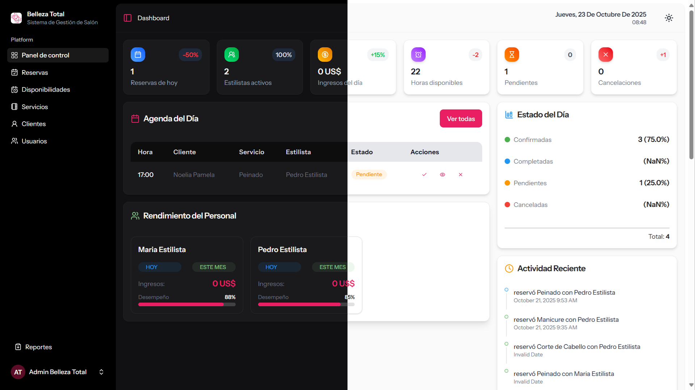

# Gestión de Reservas y Citas  
### Sistema Web Full-Stack con Laravel + React + Inertia + TailwindCSS

---

## 🚀 Descripción General  
Este proyecto es un sistema web de gestión de reservas y citas, diseñado para adaptarse a pequeños y medianos negocios que necesitan administrar su agenda de manera eficiente y moderna.  
El sistema permite gestionar usuarios, servicios, horarios y reservas, ofreciendo una interfaz dinámica y atractiva desarrollada con React e Inertia.js, respaldada por la potencia de Laravel en el backend y TailwindCSS para el diseño responsivo.  

Cuenta con un panel de control (Dashboard) completo que permite visualizar:  
- Agenda del día  
- Estado general de la jornada  
- Rendimiento del personal  
- Actividad reciente  
- Horarios activos  
- Reservas por día  
- Servicios más solicitados  

🔹 El sistema es modular y puede adaptarse fácilmente a negocios como barberías, clínicas, estudios de belleza, consultorios, talleres o cualquier empresa que gestione citas o reservas.

---

## 🧩 Tecnologías Utilizadas  

| Categoría       | Tecnologías                         |
|-----------------|-----------------------------------|
| Frontend        | React, Inertia.js, TailwindCSS    |
| Backend         | Laravel 10+                       |
| Base de Datos   | MySQL / SQLite / PostgreSQL       |
| Autenticación   | Laravel Breeze + Sanctum           |
| Otros           | Axios, Vite, Eloquent ORM          |

---

## 🗂️ Características Principales  
- **Gestión de Usuarios:** Registro, autenticación y control de roles.  
- **Gestión de Servicios:** Creación, edición y desactivación de servicios.  
- **Gestión de Horarios:** Definición de horarios laborales personalizados.  
- **Gestión de Reservas:** Control completo de citas por cliente, fecha y servicio.  
- **Dashboard Dinámico:** Métricas, estadísticas y vistas gráficas del negocio.  
- **Diseño Responsivo:** Adaptable a cualquier dispositivo.  
- **Integración Full-Stack:** Comunicación fluida entre Laravel y React mediante Inertia.js.

---

## ⚙️ Instalación y Configuración  
Sigue los pasos para ejecutar el proyecto en local:

```bash
# Clonar el repositorio
git clone https://github.com/tuusuario/gestion-reservas.git
cd gestion-reservas

# Instalar dependencias de Laravel
composer install

# Instalar dependencias de React
npm install

# Copiar el archivo de entorno
cp .env.example .env

# Configurar base de datos en el archivo .env
DB_CONNECTION=mysql
DB_DATABASE=reservas_db
DB_USERNAME=root
DB_PASSWORD=

# Generar key de aplicación
php artisan key:generate

# Ejecutar migraciones
php artisan migrate --seed

# Iniciar servidor backend
php artisan serve

# Iniciar servidor frontend
npm run dev

``````

---

## 🧠 Arquitectura del Proyecto  
El proyecto sigue una arquitectura limpia y desacoplada entre capas:  
- Laravel gestiona las rutas, modelos, controladores y lógica de negocio.  
- Inertia.js actúa como puente entre backend y frontend, sin necesidad de API REST tradicional.  
- React maneja la UI y la interacción dinámica con los datos.  
- TailwindCSS garantiza un diseño limpio, rápido y personalizable.

---

## 📊 Vista del Dashboard  


---

## 🧱 Escalabilidad  
El proyecto está preparado para:  
- Integrarse con API REST externas (p. ej., sistemas de pagos o notificaciones).  
- Añadir roles avanzados y permisos.  
- Implementar notificaciones por correo o WhatsApp.  
- Adaptarse a distintos rubros empresariales sin modificar la estructura base.

---

## 📄 Licencia  
Este proyecto se distribuye bajo la licencia MIT, lo que permite su uso, modificación y distribución libre con fines personales o comerciales.

---

## 👤 Autor  
Desarrollado por: AIsakVeliz  
💼 Desarrollador Full-Stack — Laravel | React | TailwindCSS  
🌐 https://aisakveliz.netlify.app/  
📧 aisakvelizdc@gmail.com
